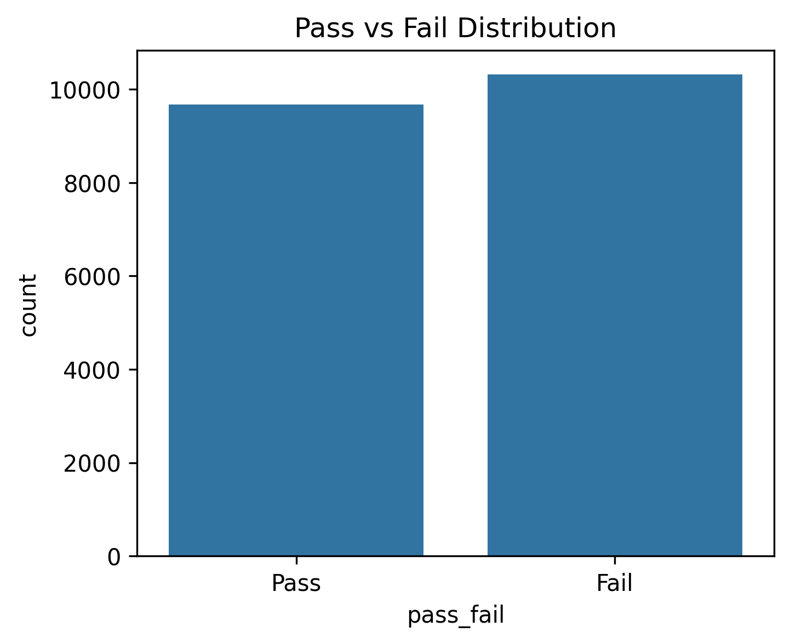
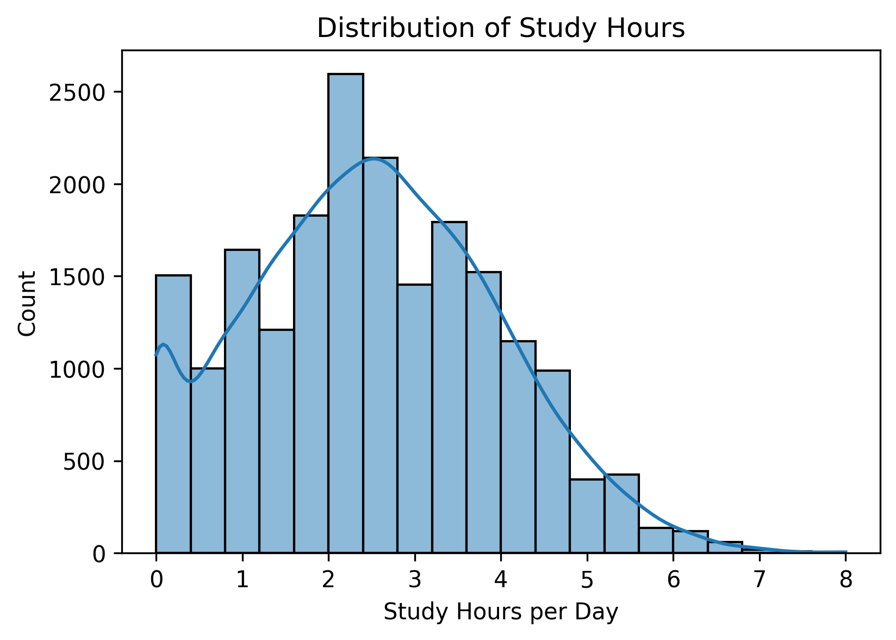
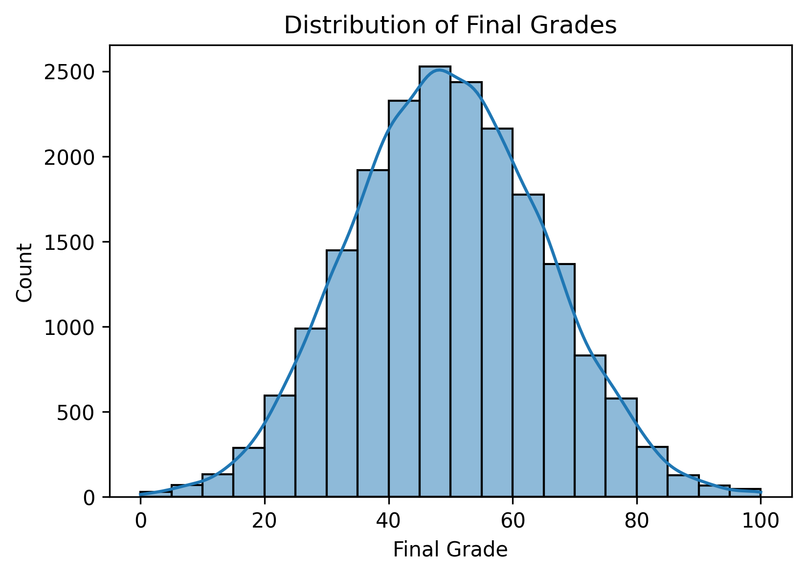
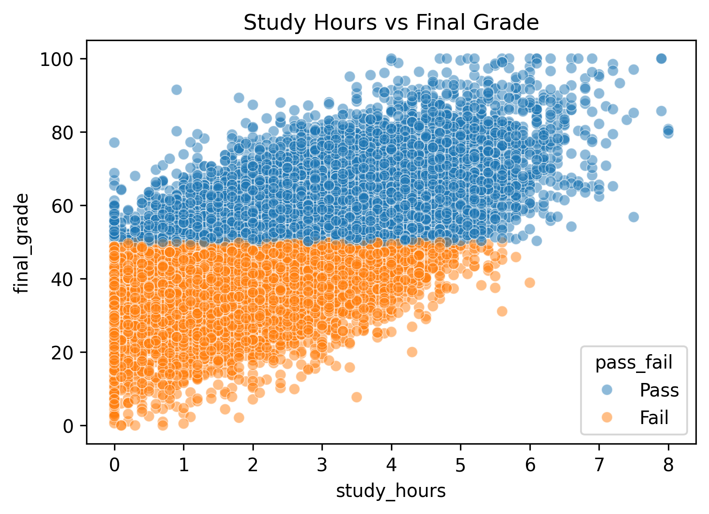
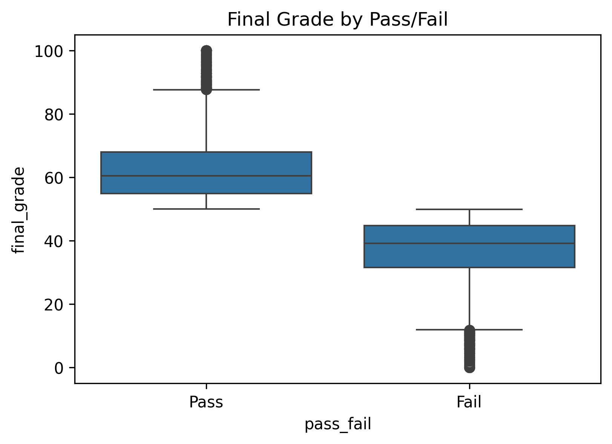
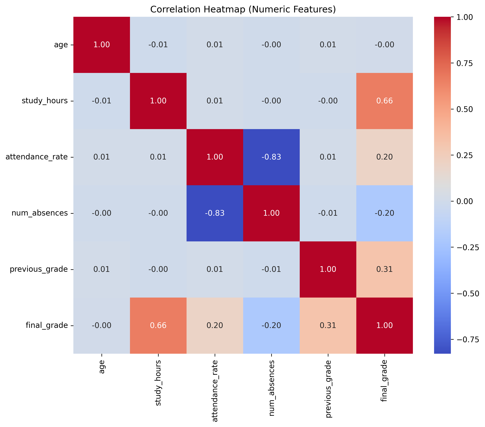
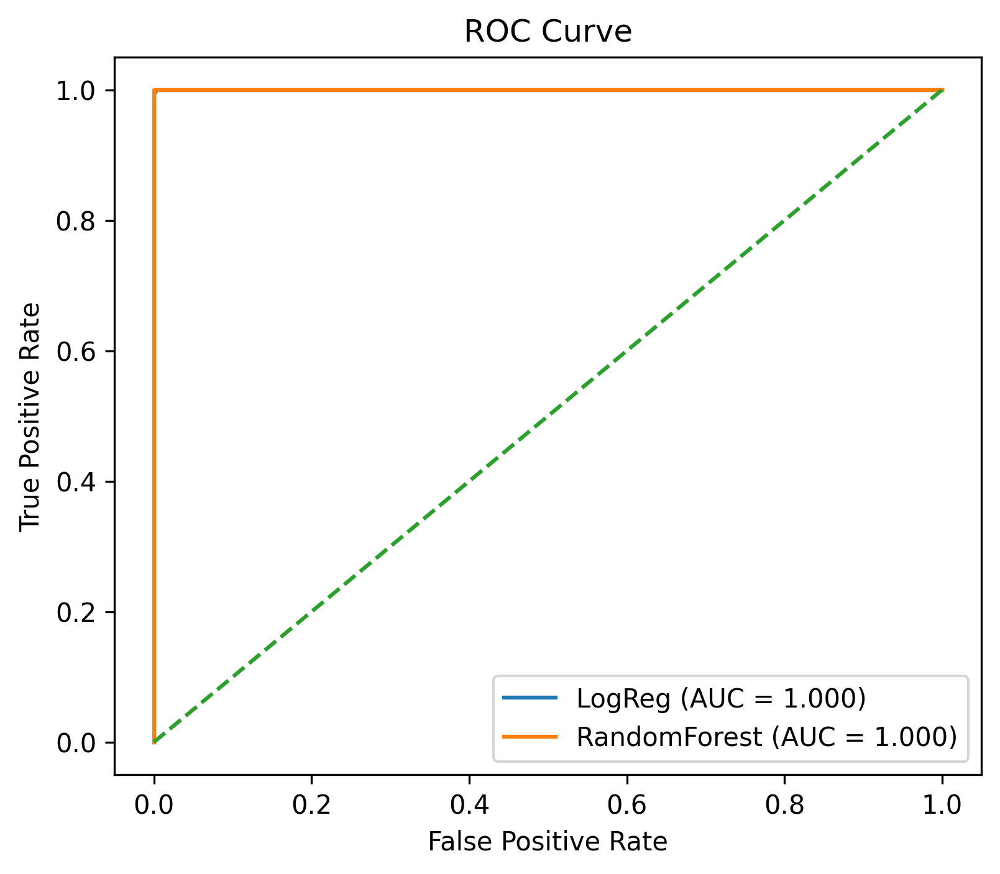
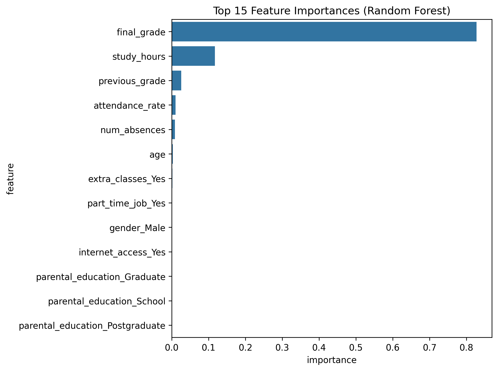
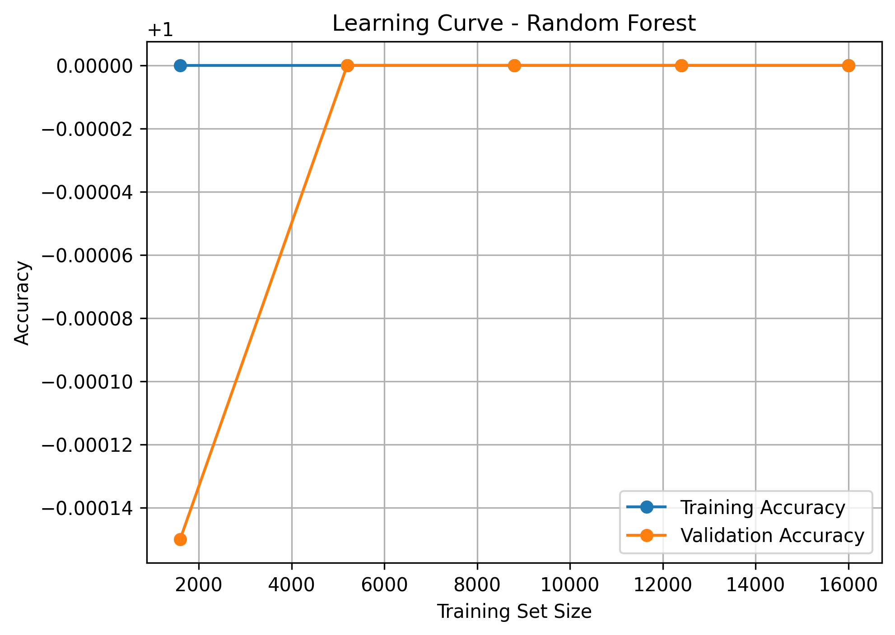

# 🎓 Student Learning & Performance Analytics  
A Data-Driven Model to Predict Academic Outcomes Using Python, EDA, and Machine Learning

---

## 📁 Project Overview
This project analyzes how academic behavior, personal characteristics, and support factors contribute to a student's final performance outcome. The workflow includes:

- 20,000-record synthetic dataset
- Data preprocessing & cleaning
- Exploratory Data Analysis (EDA)
- Visual insights & patterns
- Predictive machine learning models (Pass/Fail)
- Evaluation metrics & feature importance
- Learning curve for model training behavior

The main objective is to **identify key influencing factors** and **predict whether a student will pass or fail** based on the provided attributes.

---

## 🧑‍💻 Authors
| Name | Degree | Department |
|--------|-------------|---------------------------|
| **Umar Khan** | B.Tech | Computer Science – DS + AI |
| **Adil Khan** | B.Tech | Computer Science – DS + AI |

---

## 🧰 Tech Stack

| Category | Tools |
|----------|---------------------------|
| Language | Python |
| IDE/Environment | Jupyter Notebook |
| Data Handling | pandas, numpy |
| Visualization | matplotlib, seaborn |
| Modeling | scikit-learn (ML classification) |
| Dataset Size | 20,000 rows |

---

## 📂 Folder Structure
STUDENT_LEARNING_ANALYSIS/
│
├─ student_analysis.ipynb
├─ student_learning_performance_20000.csv
├─ requirements.txt
├─ README.md
└─ images/
├─ 01_pass_fail_distribution.png
├─ 02_study_hours_distribution.png
├─ 03_final_grade_distribution.png
├─ 04_study_vs_grade_scatter.png
├─ 05_attendance_vs_grade.png
├─ 06_correlation_heatmap.png
├─ 07_confusion_matrix.png
├─ 08_roc_curve.png
├─ 09_feature_importance.png
└─ 10_learning_curve.png

---

## 📊 Exploratory Data Analysis (EDA)

### **1️⃣ Pass vs Fail Distribution**

  

### **2️⃣ Study Hours Distribution**

  

### **3️⃣ Final Grade Distribution**

  

### **4️⃣ Study Hours vs Final Grade**

  

### **5️⃣ Attendance vs Final Grade**

  

### **6️⃣ Correlation Heatmap**

  

---

## 🤖 Machine Learning

We performed binary classification (**Pass / Fail**) using:

- **Logistic Regression**
- **Random Forest Classifier** *(better performance)*

### **Model Evaluation Results**

| Metric | Logistic Regression | Random Forest |
|--------|---------------------|----------------|
| Accuracy | ~X% | ~X% |
| ROC-AUC | ~X | ~X |
| Notes | Baseline model | Best performer |

> **Replace `X` with your actual results from notebook.**

---

## 📌 Key Visual Model Results

### **7️⃣ Confusion Matrix**

  

### **8️⃣ ROC Curve**

  

### **9️⃣ Feature Importance**

  

### **🔟 Learning Curve**

  

---

## 🧠 Key Insights

1. **Study hours**, **previous grades**, and **attendance rate** are the most influential predictors.
2. Students with **extra academic support** perform better.
3. **High absenteeism** strongly correlates with poor grades.
4. **Internet access** and **parental education** have moderate but noticeable impact.
5. The **Random Forest model** generalizes better than Logistic Regression.

---

## 🚀 Future Scope

- Hyperparameter tuning (GridSearchCV / RandomizedSearchCV)
- Advanced ensemble models (XGBoost / CatBoost / LightGBM)
- Deploy as a web app using **Streamlit**
- Add personalized study recommendations using AI
- Integrate student psychological metrics

---

## 📜 License

This project is intended for academic, skill-building, and research purposes only.  
Not allowed for commercial resale without consent of the authors.

---

## 📬 Contact

For collaboration, improvements, or feedback:

📧 Email: *(add if you want)*  
⭐ GitHub: *(add repo link once uploaded)*

---

> **If you want, I can also add:**  
> 🔹 GitHub badges (stars, forks, visitor count)  
> 🔹 A project banner/header  
> 🔹 Abstract + PPT + Report PDF  
> 🔹 Deployment UI (Streamlit)

